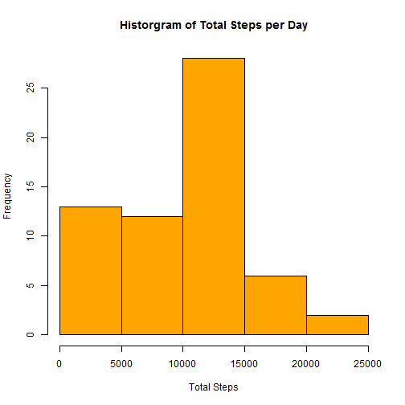
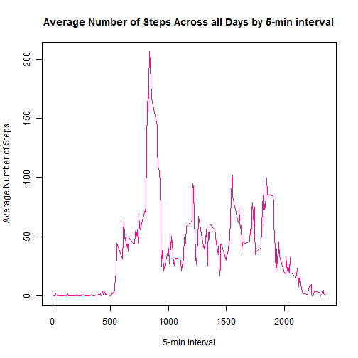
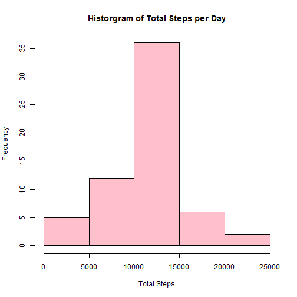
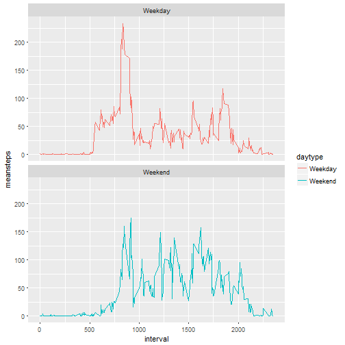

##Loading & Preprocessing Data

In this code chunk the data will be downloaded, loaded into memory, and preprocessed.  


```r
library(tidyverse)
library(lattice)

#read in the data & store copy
data <- read.csv("activity.csv")
main <- data
main$date <- as.Date(main$date)
```

##Mean Total Number of Steps Taken Per Day?
Answer the following question:   
1. Calculate the total number of steps taken per day  
 
2. If you do not undertand the difference between a histogram and a barplot, research the difference between them. Make a histogram of the total number of steps taken each day  


```r
#Calculate  steps per day
total_steps <- group_by(main, date)
total_steps <- summarise(total_steps, total = sum(steps, na.rm = TRUE))

#Create Histogram 
hist(total_steps$total, main = "Historgram of Total Steps per Day", xlab = "Total Steps", col="orange")
```



```r
#Calculate Mean & Median
mean <- mean(total_steps$total)
median <- median(total_steps$total)
```
  
  
3. Calculate and report the mean and median of the total number of steps taken per day.  
The mean total number of steps per day is **9354.2** & the median total number of steps taken per day is **10395**.  

##What is the average daily activity pattern?  
1. Make a time series plot of the 5-minute interval and the average number of steps taken, average across all days.  


```r
#Group data by interval & calculate mean steps
tsdata <- group_by(main, interval)
tsdata <- summarise(tsdata, meansteps = mean(steps, na.rm = TRUE))

#Create Histogram
plot(tsdata$interval, tsdata$meansteps,
     type = "l",
     ylab = "Average Number of Steps",
     xlab = "5-min Interval",
     col = "#EE1289",
     main = "Average Number of Steps Across all Days by 5-min interval")
```



```r
#Calculate the interval at which the max number of mean steps
interval <- tsdata[which.max(tsdata$meansteps), 1]
```

2. Which 5-minute interval, on average across all the days in the dataset, contains the maximum number of steps?
The 5-minute interval that contains the maximum number of steps is **835**

##Imputing Missing Values


```r
#Calculate the # of rows with missing values
missing <- sum(!complete.cases(main))

#Strategy for filling in missing data
newdata <- transmute(main, 
                     interval = main$interval,
                     date = main$date,
                     newsteps = ifelse(is.na(main$steps), 
                                       tsdata$meansteps[match(main$interval, tsdata$interval)], main$steps))

#Calculate  steps per day
new_total_steps <- group_by(newdata, date)
new_total_steps <- summarise(new_total_steps, total = sum(newsteps, na.rm = TRUE))

#Create Histogram 
hist <- hist(new_total_steps$total, main = "Historgram of Total Steps per Day", xlab = "Total Steps", col="pink")
```



```r
#Calculate Mean & Median
new_mean <- mean(new_total_steps$total)
new_median <- median(new_total_steps$total)
```

1. Calculate and report the total number of missing values in the dataset.  
There are **2304** values in the dataset.  

2. Devise a strategy for filling in all of the missing values in the dataset. The strategy does not need to be sophisticated. For example, you could use the mean/median for that day, or the mean for that 5-minute interval, etc.  
**The missing values were filled in based on the mean for that 5-minute interval**

3. Create a new dataset that is equal to the original dataset but with the missing data filled in.  

4. Make a histogram of the total number of steps taken each day and Calculate and report the mean and median total number of steps taken per day. Do these values differ from the estimates from the first part of the assignment? What is the impact of imputing missing data on the estimates of the total daily number of steps?
**The new mean is 1.0766189 &times; 10<sup>4</sup> & new median is 1.0766189 &times; 10<sup>4</sup>.  The values differ from the estimates in the first part of the assignment.**  

##Are there differences in activity patterns between weekdays and weekends?
1.Create a new factor variable in the dataset with two levels indicating whether a given date is a weekday or weekend day.

2. Make a panel plot containing a time series plot of the 5-minute interval (x-axis) and the average number of steps taken, averaged across all weekday days or weekend days (y-axis). 


```r
#Group data by interval & calculate mean steps
weekday <- c("Monday", "Tuesday", "Wednesday", "Thursday", "Friday")
activity <- mutate(main, day = as.factor(weekdays(main$date)))
activity <- mutate(activity, daytype = ifelse(activity$day %in% weekday, "Weekday", "Weekend"))
activity <- group_by(activity, daytype, interval)
activity <- summarise(activity, meansteps = mean(steps, na.rm = TRUE))

#Create Histogram
plot <- ggplot(activity, aes(x = interval, y = meansteps, color = daytype)) +
        geom_line() +
        facet_wrap(~daytype, ncol = 1, nrow = 2)
        labs(title = "Average Number of Steps by 5-min interval for Weekday vs. Weekend", 
             y = "Average Number of Steps", 
             x = "5-min Interval")
```

```
## $title
## [1] "Average Number of Steps by 5-min interval for Weekday vs. Weekend"
## 
## $y
## [1] "Average Number of Steps"
## 
## $x
## [1] "5-min Interval"
## 
## attr(,"class")
## [1] "labels"
```

```r
print(plot)
```



